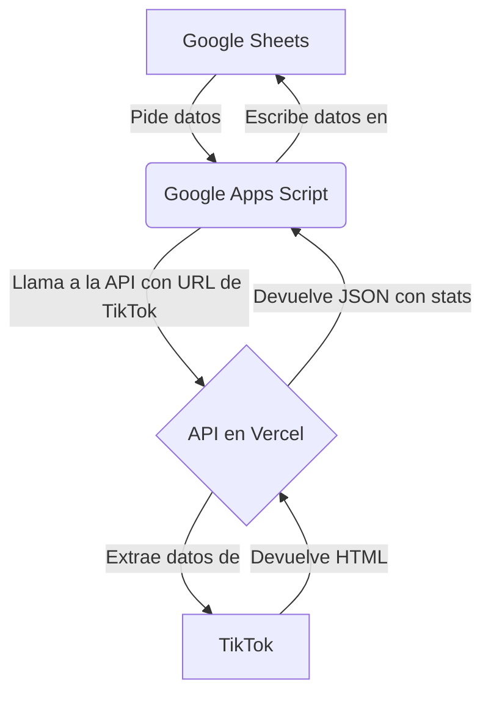

# Solución Completa: Extractor de TikTok Stats con API Proxy

Esta es una solución completa para extraer estadísticas de TikTok en Google Sheets, evitando el bloqueo de seguridad de Google mediante el uso de una API intermediaria (proxy) desplegada en **Vercel**.

## Arquitectura de la Solución

El sistema funciona en tres capas:

1.  **Google Sheets (Frontend)**: Tu hoja de cálculo donde pegas las URLs de TikTok y ves los resultados.
2.  **Google Apps Script (Backend en Sheets)**: La macro que se comunica con nuestra API.
3.  **API Proxy en Vercel (Backend Real)**: Un servicio web que recibe la petición de Google Sheets, extrae los datos de TikTok de forma segura y los devuelve.



Este enfoque resuelve el problema porque Google Apps Script ya no intenta acceder directamente a `tiktok.com`, sino a tu propia API en Vercel, lo cual es una operación permitida.

---

## Parte 1: Desplegar la API en Vercel

En esta parte, publicarás el servicio web que extrae los datos. Usaremos Vercel porque es gratuito y muy fácil de usar con GitHub.

### Requisitos

- Una cuenta de [GitHub](https://github.com/) (gratuita).
- Una cuenta de [Vercel](https://vercel.com/) (gratuita), regístrate usando tu cuenta de GitHub.

### Paso 1: Crear un Repositorio en GitHub

1.  Inicia sesión en GitHub.
2.  Crea un **nuevo repositorio**. Puedes llamarlo `tiktok-stats-api`.
3.  **Importante**: Asegúrate de que sea un repositorio **Público** para que Vercel pueda acceder a él fácilmente.

### Paso 2: Subir los Archivos de la API a GitHub

Sube los siguientes archivos y carpetas a tu nuevo repositorio de GitHub. La estructura debe ser idéntica.

```
/ (raíz del repositorio)
├── api/
│   └── stats.py
├── .gitignore
├── README.md
├── requirements.txt
└── vercel.json
```

- **`api/stats.py`**: El código Python de la API.
- **`requirements.txt`**: Las dependencias que necesita el código.
- **`vercel.json`**: El archivo de configuración para Vercel.
- Los otros archivos (`.gitignore`, `README.md`) son opcionales pero recomendados.

### Paso 3: Conectar y Desplegar en Vercel

1.  Inicia sesión en tu panel de [Vercel](https://vercel.com/dashboard).
2.  Haz clic en **`Add New...`** > **`Project`**.
3.  En la sección **`Import Git Repository`**, selecciona tu nuevo repositorio de GitHub (`tiktok-stats-api`).
4.  Vercel detectará automáticamente que es un proyecto de Python y leerá el archivo `vercel.json`. No necesitas configurar nada.
5.  Haz clic en el botón **`Deploy`**.

El proceso de despliegue tardará 1-2 minutos. Al finalizar, Vercel te asignará una URL pública para tu API, algo como `https://tiktok-stats-api-xxxxx.vercel.app`.

**¡Guarda esta URL! La necesitarás en la siguiente parte.**

---

## Parte 2: Configurar Google Sheets

Ahora que tu API está en línea, configuraremos la hoja de cálculo para que la use.

### Paso 1: Abrir el Editor de Apps Script

1.  Abre tu hoja de Google Sheets.
2.  Ve al menú `Extensiones` > `Apps Script`.

### Paso 2: Pegar el Código del Script

1.  Borra cualquier código que haya en el editor.
2.  Copia y pega el contenido completo del archivo `GoogleAppsScript.gs`.
3.  Guarda el proyecto (ícono de disquete 💾).

### Paso 3: Configurar la URL de tu API

1.  **Refresca la pestaña de tu Google Sheet** para que aparezca el nuevo menú.
2.  Ve al menú `TikTok Stats` > `⚙️ Configurar URL de API`.
3.  En el cuadro de diálogo, pega la **URL de Vercel** que obtuviste en la Parte 1.
    - **Importante**: La URL debe incluir la ruta completa, por ejemplo: `https://tiktok-stats-api-xxxxx.vercel.app/api/stats`
4.  Haz clic en `Aceptar`.

### Paso 4: Probar la Conexión

1.  Ve al menú `TikTok Stats` > `🧪 Probar Conexión con API`.
2.  Si todo está configurado correctamente, recibirás un mensaje de **"✅ Conexión exitosa"** con algunas estadísticas de un video de ejemplo.
    - Si recibes un error, verifica que la URL de la API sea correcta y que el despliegue en Vercel haya finalizado sin problemas.

## Parte 3: Usar la Macro

¡Ya está todo listo! Ahora puedes usar la macro como se diseñó originalmente.

1.  **Pega las URLs de TikTok** en la columna `D` (a partir de la fila 3).
2.  **Ejecuta la actualización** de una de estas dos formas:
    - **Opción A (Menú)**: Ve a `TikTok Stats` > `🔄 Actualizar Estadísticas`.
    - **Opción B (Botón)**: Crea un botón en tu hoja (usando `Insertar` > `Dibujo`), asígnale la función `actualizarEstadisticasTikTok` y haz clic en él.

El script ahora se comunicará con tu API en Vercel para obtener los datos de forma segura, y los resultados aparecerán en tu hoja de cálculo sin ser bloqueado por Google.

